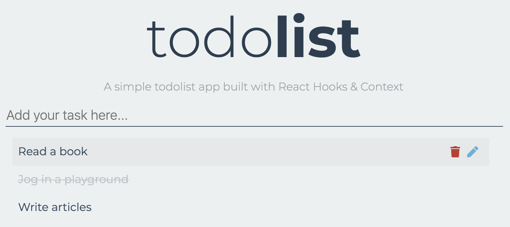

# React Hooks todolist



> A simple todolist app built with React Hooks & Context

Read my medium post [here](https://medium.com/@walkccc/build-a-todo-list-app-with-react-hooks-and-context-a7f8e9f158af) to walkthrough this project.

## Scripts

Clone this app and run

```
npm install
npm start
```

to preview it in the browser.
